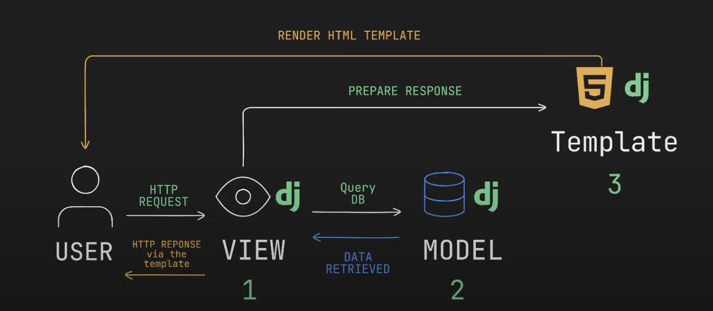

# Django 2024

- A python based web framework
- Sometimes called as batteries included fraemwork - because it comes with a lot of built-in features

### Why Django? - Features

- Rapid development
- Database flexibility
- Built in admin interface
- Django uses Django template language (similar to jinja2 in flask)

### Model View Template (MVT) Architecture

- Model: Database

    - ORM: Object Relational Mapping

- View: Business Logic

    - receives http requests and returns http response

- Template: User Interface

    - HTML files




## FastAPI v/s Flask v/s Django

- Flask:
    - Minimalist framework with extendable features
    - Great for building small to medium sized applications
    - Easiest to learn

- Django:
    - Has features that saves a lot of times
        - ORM
        - Forms
        - Authentication
    - Ideal for handling complex web applications
    - Conventional project structure
    - Complex to learn

- Fast APi
    - New framework
    - Asynchronous support
    - Automatic data validation
    - Automatic Generation of OpenAPI documentation
    - Great for quickly building APIs that are self documented
    - Slightly trickier to setup

## Django Installation

'-m' flag is used to run module as script in python

## Running Django

```django-admin startproject mysite```

- Every folder has ```__init__.py``` file which tells every directory that this is a package
- ```asgi.py``` stands for Asynchronous Server Gateway Interface : its like bridge between web server and django application - which in turn is used to handle multiple requests at the same time
- ```settings.py``` : contains all the settings for the project - including database settings, secret key, installed apps, middlewares, templates, static urls, css, or to embed js to project

- ```urls.py``` : contains all the urls for the project

- ```wsgi.py``` : Web Server Gateway Interface - used to deploy the project to a web server

- ```manage.py``` : used to run commands for the project - acts as wrapper around django adminstrative tasks

---

To start app

```python3 manage.py startapp myapp```

To run the server:

```python3 manage.py runserver```